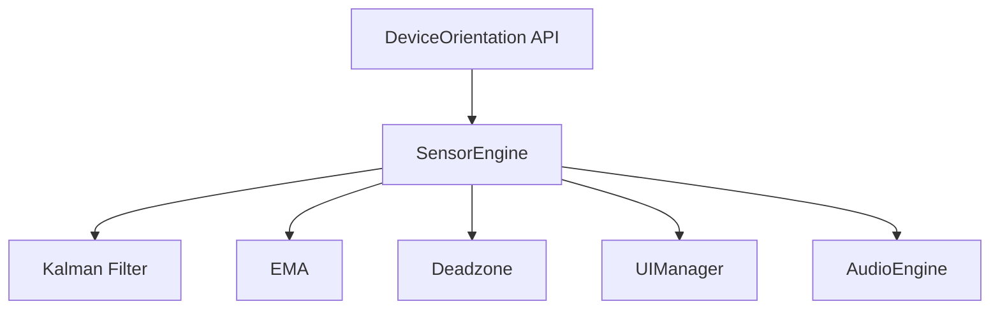

# 高精度傾斜角センサー PWA 運用手順書
更新日: 2026-02-13

## 1. 文書概要

本書は、本アプリケーションの構成、技術要素、導入手順および確認手順を、運用担当者向けに整理したものである。

## 2. 構成ファイル

| ファイル | 役割 |
|------|------|
| `index.html` | 画面構成および主要 UI 定義 |
| `style.css` | 画面スタイル、状態表現、レスポンシブ制御 |
| `app.js` | センサー演算、音声制御、UI 更新、設定保存 |
| `manifest.json` | PWA マニフェスト情報 |
| `sw.js` | オフラインキャッシュ制御 |
| `icons/` | アプリケーションアイコン（SVG） |

## 3. 技術構成



## 4. 機能一覧

- 2軸傾斜角のリアルタイム表示
- カルマンフィルタ・EMA・デッドゾーンによる安定化処理
- 前後左右方向を識別する音声フィードバック
- キャリブレーション機能
- 設定値のローカル永続化
- PWA インストール対応

## 5. 導入手順

### 5.1 GitHub Pages で公開する場合

```bash
cd c:\Users\AKIHIRO\.gemini\antigravity\High-precision-sensor
git init
git add .
git commit -m "Initial commit"
git remote add origin https://github.com/<ユーザー名>/High-precision-sensor.git
git push -u origin main
```

公開後、`https://<ユーザー名>.github.io/High-precision-sensor/` にアクセスする。

### 5.2 ローカル検証を行う場合

同一ネットワーク上の iPhone からローカルサーバー URL へアクセスする。なお、HTTP 環境では Service Worker が有効化されないため、PWA 機能確認は HTTPS 環境で実施すること。

## 6. iPhone でのインストール手順

1. Safari で公開 URL を開く。
2. 共有メニューから「ホーム画面に追加」を選択する。
3. 追加後、ホーム画面上のアイコンから起動する。

## 7. 関連資料

- `docs/Accuracy_Estimation_Report.md`
- `docs/Technical_Logic_Explanation.md`
- `docs/implementation_plan.md`
- `docs/task.md`
