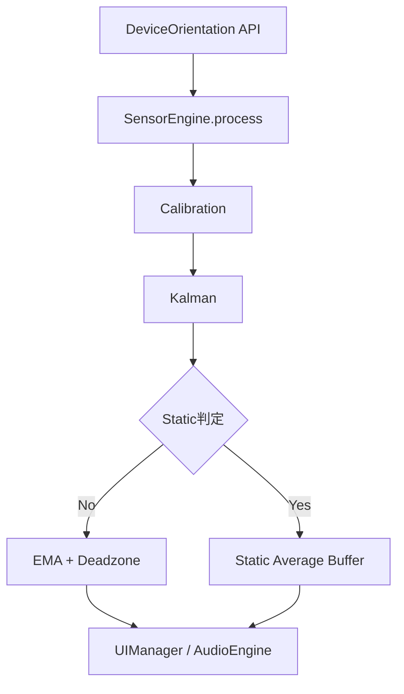

# 高精度傾斜角センサー 開発ガイド

更新日: 2026-02-18

## 1. 文書概要

本書は、開発者向けに本アプリの主要モジュール、静止平均ハイブリッドアルゴリズム、検証手順を整理したガイドである。

## 2. 主要構成

| パス | 役割 |
|------|------|
| `index.html` | 画面構成と設定パネル定義 |
| `assets/css/style.css` | UI状態表示、レスポンシブスタイル |
| `assets/js/app.js` | アプリ統合、設定保存復元、状態表示制御 |
| `assets/js/modules/SensorEngine.js` | Kalman/EMA/Deadzone + Static Average 本体 |
| `assets/js/modules/AppEventBinder.js` | UIイベントとセンサーパラメータの接続 |
| `assets/js/modules/UIManager.js` | 数値表示、ステータス更新、描画 |
| `tests/*.test.js` | ユニットテスト |
| `tests/e2e-offline-smoke.mjs` | オフライン起動と主要動作のE2Eスモーク |

## 3. ハイブリッド処理フロー

## 4. モード定義

| mode | 意味 | 画面表示 |
|------|------|------|
| `active` | 通常追従モード | `計測中` |
| `locking` | 静止判定後、平均化途中 | `LOCKING...` |
| `measuring` | 必要サンプル到達後 | `MEASURING` |

## 5. 調整可能パラメータ

| 設定キー | UI要素ID | 既定値 |
|------|------|------|
| `emaAlpha` | `filter-alpha` | `0.08` |
| `deadzone` | `deadzone` | `0.005` |
| `staticVarianceThreshold` | `static-variance-threshold` | `0.002` |
| `staticDurationFrame` | `static-duration-frame` | `30` |
| `averagingSampleCount` | `averaging-sample-count` | `60` |
| `soundEnabled` | `btn-sound-toggle` | `false` |
| `outputType` | `data-output-type` | `normal` |
| `soundMode` | `data-sound-mode` | `continuous` |
| `soundThreshold` | `sound-threshold` | `1.0` |
| `masterVolume` | `master-volume` | `0.5` |

## 6. ローカル検証

1. ユニットテスト: `npm test -- --run`
2. E2Eスモーク: `npm run test:e2e-smoke`
3. 手動確認:
   - センサー入力継続時に `LOCKING...` / `MEASURING` へ遷移すること
   - 入力停止時に `センサー信号待ち` へ遷移すること
   - 再入力で状態復帰すること

## 7. 関連資料

- `docs/high-precision-sensor/02_TechnicalSpec.md`
- `docs/high-precision-sensor/06_Proposal_Hybrid_Static_Average.md`
- `docs/high-precision-sensor/07_Optimization_and_Verification_Plan.md`
- `docs/high-precision-sensor/13_TwoPointCalibration_Design.md`

## 8. 2点キャリブレーション実装メモ

- 追加UI:
  - `#btn-calibrate-2pt`（専用ボタン）
- `SensorEngine` 追加API:
  - `startTwoPointCalibration()`
  - `captureTwoPointCalibrationPoint()`
  - `cancelTwoPointCalibration()`
  - `getTwoPointCalibrationState()`
- 取得条件:
  - `measurementMode` が `locking` / `measuring` のみ取得許可
- タイムアウト:
  - 1点目取得後 `30000ms`
