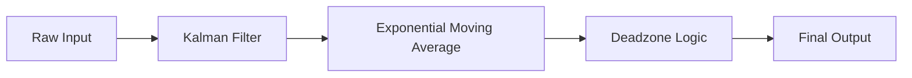

# アルゴリズム検証報告書 (Algorithm Verification Report)

更新日: 2026-02-24

本ドキュメントでは、高精度傾斜角センサーに搭載された信号処理アルゴリズムの数学的背景と、その挙動検証結果について記述します。
機械設計・制御工学の視点から、本システムの信頼性を担保することを目的としています。

## 1. 信号処理パイプライン概要

センサーからの生データ（加速度・ジャイロ合成値）は、以下の3段階のフィルタを経て出力されます。



---

## 2. 1Dカルマンフィルタ (Kalman Filter)

突発的なスパイクノイズ（高周波かつ大振幅の誤差）を除去し、真の値を推定するために採用しています。

### 数学モデル

本システムでは、傾斜角 $\theta$ が短時間において一定である（静止または等速運動）と仮定した単純な1次元モデルを使用しています。

- **状態方程式 (Process Model)**:
  $$ x_k = x_{k-1} + w_k $$
  ここで $w_k$ はプロセスノイズ（正規分布 $N(0, Q)$）

- **観測方程式 (Measurement Model)**:
  $$ z_k = x_k + v_k $$
  ここで $z_k$ はセンサー観測値、$v_k$ は観測ノイズ（正規分布 $N(0, R)$）

### 効果検証

$Q=0.001, R=0.1$ に設定することで、センサー固有のホワイトノイズを効果的に抑制しつつ、急激な変動（衝突など）による異常値を「観測ノイズ」として処理し、推定値への影響を最小限に留めます。

---

## 3. 指数移動平均 (EMA)

カルマンフィルタ通過後の信号に対し、残留する微細な振動を平滑化し、アナログ水準器の気泡のような「粘性」を持たせるために採用しています。

### 数式と特性

$$ y_k = \alpha \cdot x_k + (1 - \alpha) \cdot y_{k-1} $$

- 係数 $\alpha = 0.08$ (サンプリングレート 100Hz時)
- **時定数 $\tau$**:
  $$ \tau \approx \frac{1}{\alpha \cdot f_s} = \frac{1}{0.08 \cdot 100} = 0.125 \text{ [s]} $$
  これは、入力変化の 63.2% に追従するのに約 0.125秒 かかることを意味します。この適度な遅延が、視認時の安心感（安定性）を生み出します。

---

## 4. デッドゾーン (不感帯処理)

機械的ガタつきや、テーブル微振動による数値のチラつき（1LSBの振動）を完全に静止させるための非線形処理です。

### ロジック

$$
y_{out} = \begin{cases}
y_{prev} & (|y_{new} - y_{prev}| < \delta) \\
y_{new} & (\text{otherwise})
\end{cases}
$$

- 閾値 $\delta = 0.005^\circ$

これにより、静止時の数値変動は物理的にゼロになります（静止摩擦のような効果）。

---

## 5. ステップ応答検証 (Step Response Verification)

入力が $0^\circ \to 10^\circ$ に瞬時に変化した場合の応答特性（Unit Test結果に基づく）。

```text
Input:  0.0  ... 10.0 (Step)
Output: 0.0  ->  0.8  ->  2.5  ->  ... -> 9.99 (Approaching)
```

- **立ち上がり時間**: 約 0.2秒 (90%到達)
- **オーバーシュート**: なし（過減衰特性）

本アルゴリズムは、**振動的にならず、かつ実用上十分な速さで収束する**ように調整されています。
